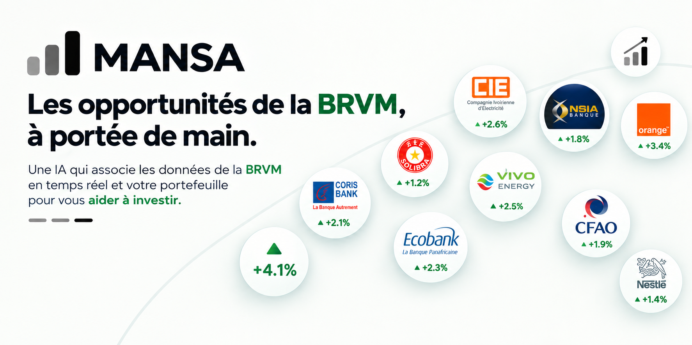

<p align="center">
  <a href="https://mansa-jet.vercel.app/">
    
  </a>
</p>

<p align="center">
  <a href="https://mansa-jet.vercel.app/"></a>
</p>

<p align="center">
  Un assistant pour suivre son portefeuille d'actions de la BRVM<br>
  (Bourse régionale des valeurs mobilières, Afrique de l'Ouest)<br>
  et poser des questions sur le marché du jour.
</p>

<p align="center"><b>Application en ligne : <a href="https://mansa-jet.vercel.app/">https://mansa-jet.vercel.app/</a></b></p>

---

## Ce que fait l'application

- Chaque utilisateur crée un compte et saisit ses titres, ses quantités et ses liquidités.
- Le portefeuille est valorisé aux cours de la dernière séance : valeur, plus-value, poids de chaque ligne, courbe sur 1 mois à 1 an.
- L'assistant répond aux questions en français en s'appuyant sur le portefeuille et sur les données de marché (cours, RSI, variations, historique).
- Le modèle d'IA se choisit dans un menu : DeepSeek par défaut, Gemini et NVIDIA en option.

## Organisation du dépôt

| Dossier | Rôle | Hébergement |
|---|---|---|
| [`brvm-data/`](brvm-data/) | Collecte chaque jour de bourse les cours de 49 actions et 18 indices, et calcule les indicateurs | GitHub Actions |
| [`brvm-mcp/`](brvm-mcp/) | Serveur MCP qui expose ces données sous forme d'outils | Render |
| [`app/`](app/) | Application web : comptes, portefeuille, assistant | Vercel |

```
GitHub Actions ──▶ brvm-data (CSV) ──▶ serveur MCP ──▶ application MANSA ◀── utilisateurs
                                                          │
                                           Supabase (comptes, portefeuilles)
                                           modèle d'IA (DeepSeek, Gemini…)
```

## Technologies

Python, FastAPI, MCP (Model Context Protocol), Supabase, HTML et JavaScript sans framework.

## Lancer l'application en local

Voir [`app/README.md`](app/README.md).

---

Les analyses de l'assistant sont automatiques et ne constituent pas un conseil en investissement.
